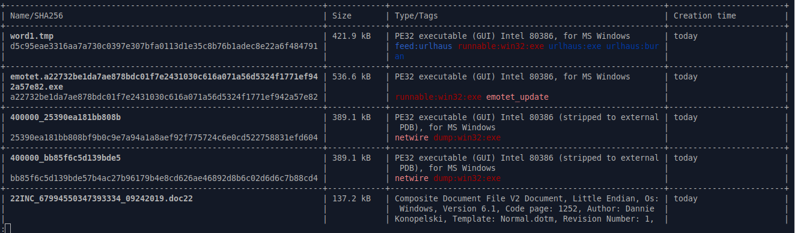
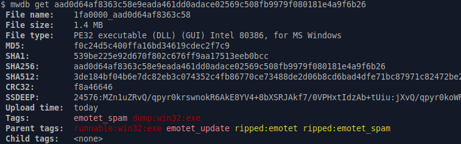

Command-line interface
======================

.. versionadded:: 3.0.0

MWDB library is providing optional command line interface, which can be used to interact with MWDB repository.

Command-line interface can be installed using `pip` and is available via `mwdb` command:

.. code-block:: none

   $ pip install mwdblib[cli]
   $ mwdb version
   3.0.0

User authentication
-------------------

Before we start, we need to setup credentials. If you don't do that, you will be asked for them on each access to MWDB API.

.. code-block:: none

   $ mwdb login
   Username: user
   Password:

If you want, you can also provide your API key instead of storing your password in keyring.

.. code-block:: none

   $ mwdb login -A
   Provide your API key token:

Just copy your API token from `/profile` view and paste into the CLI. All secrets will be stored in `keyring`
and your username will be saved in `~/.mwdb` file.

.. versionadded:: 3.4.1

If you're using mwdblib to interact with your self-hosted mwdb-core instance, you can now pass the api url using the
standard --api-url option and it will be automatically saved in the config file.

Looking for recent data
-----------------------

Let's start with listing the latest samples in your workspace. After typing

.. code-block:: none

   $ mwdb list

you will see the list of samples similar to the main MWDB webapp view.

If you don't like pager or coloring, you can use `nocolor` and `nopager` modifiers.

.. code-block:: none

   $ mwdb list -o nopager,nocolor --limit 5

Recent lists are limited by default to 200 entries. If you want to find more or less, you can use `--limit` option but be careful
not to exceed the requests limit or your session will be temporarily throttled.

If you want only to get IDs of recent files, you need to use `short` modifier

.. code-block:: none

   $ mwdb list -o short -n 1
   aad0d64af8363c58e9eada461dd0adace02569c508fb9979f080181e4a9f6b26

Gathering information about objects
-----------------------------------

If you want to get detailed information about specific object, use `get` subcommand.

File can be download using `fetch` command.

.. code-block:: none

   $ mwdb fetch aad0d64af8363c58e9eada461dd0adace02569c508fb9979f080181e4a9f6b26 --keep-name
   $ ls
   1fa0000_aad0d64af8363c58

If you'd like to store file under its original name, you can use `keep-name` option as presented above. File will be
stored in current working directory.

In case your file is already stored in your local filesystem, instead of providing SHA256 hash, you can just provide the path so hash
will evaluated automatically. For example, getting list of comments for locally stored sample.exe looks like below:

.. code-block:: none

   $ mwdb get comments ./sample.exe

Searching data using Lucene query
---------------------------------

If you want to search all files tagged as `danabot`, you can use Lucene query presented below

.. code-block:: none

   $ mwdb search "tag:danabot"

Commands `search` or `list` are assuming that user is looking for files. If you want to search other type of objects,
you need to use alternative variants:

.. code-block:: none

   $ mwdb search configs "family:danabot"
   $ mwdb search objects "tag:*danabot*"

Uploading files
---------------

Let's assume you want to upload `dropper.js`. Just type:

.. code-block:: none

   $ mwdb upload dropper.js

If you want to upload a drop called `drop.exe` and add relation to previously uploaded `dropper.js` you can specify parent:

.. code-block:: none

   $ mwdb upload dropper.js --parent drop.exe

... and if you want to suggest the family, add appropriate tag:

.. code-block:: none

   $ mwdb tag drop.exe probably:netwire

You can then check information about uploaded object

.. code-block:: none

   $ mwdb get drop.exe
