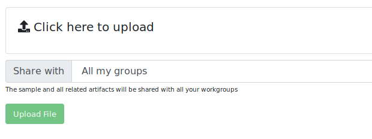
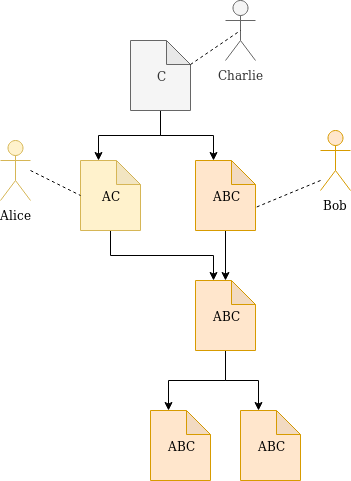

Sharing model
=============

One of the main applications of Malwarecage is being an data exchange platform to share results of malware analysis across the researchers community.

All Malwarecage users are grouped in common workspaces called *groups*. There are few types of groups:

- **regular** groups, associating a group of users and allowing mutual exchange of data within the group
- **private** groups, being an private workspace associated only with user account
- **public** group, associated with all Malwarecage users and dedicated for public data sharing

When you want to upload sample to database, you can choose which group you want the sample to be shared with.

- **All my groups**: share sample with all my workgroups
- **Single group...**: share with one of the groups
- **Everybody**: share with the **public** group
- **Only me**: share with nobody (effectively only you and CERT.pl staff when using mwdb.cert.pl service)

Keep in mind that your private group is always included, so uploaded samples will be always added to your
private repository, no matter what option you choose.

Access rights inheritance
-------------------------

If you add sample with specifing sharing rights, you actually share the whole subtree of objects. All object permissions
are inherited from its parents, so using Malwarecage you're guaranteed to see all descendant objects from uploaded one.

Don't worry to upload samples you want to share exclusively with CERT.pl (*Only me* option). Sample will be visible
only by its uploaders (another uploader must already have this sample or archive containing this sample). Uploading one
of related descendants doesn't share the ancestors.
